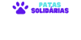

<div align="center">
  
</div>

<div align="center">
    
    
    
</div>

A Adopet é uma inovadora empresa fictícia de adoção, que tem como objetivo conectar adotantes e animais que buscam um lar. O projeto foi realizado seguindo o design do [Figma](https://www.figma.com) fornecido no 4º desafio Front-End da Alura. Um prazo de 4 semanas foi estabelecido para atender às demandas detalhadas no [Trello](https://trello.com/pt-BR?&aceid=&adposition=&adgroup=148159506607&campaign=19269516466&creative=641463051732&device=c&keyword=trello&matchtype=e&network=g&placement=&ds_kids=p74543507295&ds_e=GOOGLE&ds_eid=700000001557344&ds_e1=GOOGLE&gad=1&gclid=CjwKCAjwzo2mBhAUEiwAf7wjksrPgC2nQlMN04GbQw7YH1IJV0AN-7F3fqHjYUy35ouy2vv3QZ7HCRoCkgUQAvD_BwE&gclsrc=aw.ds).

 
[Link demonstrativo](https://meteora-94nu-g43gmvcza-bielq26.vercel.app/)

## Layout


## Como iniciar este projeto?

``` bash
# Para iniciar a aplicação, é necessário que o Node.js esteja instalado no computador.

# Vá ao seu terminal e clone este repositório:
$ git clone https://github.com/Gabriel-Ferreira-Qz/Meteora.git

# Acesse a pasta do projeto:
$ cd meteora 

# instale todas as dependências:
$ npm i

# Execute a aplicação:
$ npm start

# A aplicação será iniciada na porta 3000: "http://localhost:3000"
```

## Autor do Projeto
[Linkedin](https://www.linkedin.com/in/gabriel-queiroz-7a1428212/)