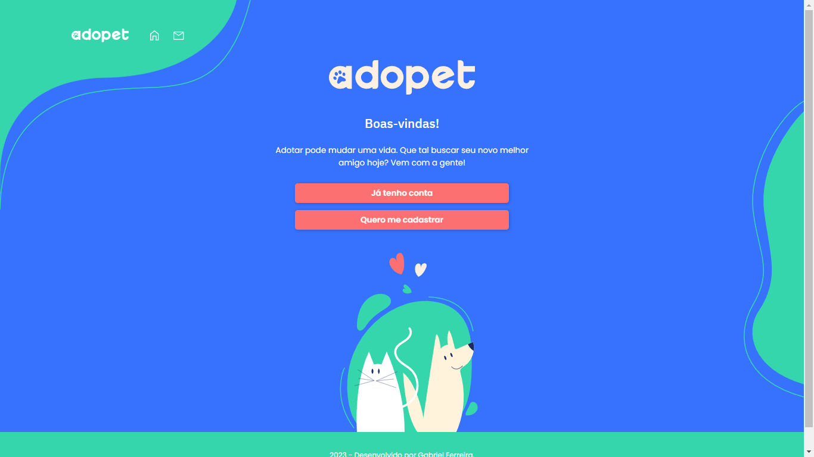

# Adopet: Adoção de Pets 🐾

A Adopet é uma inovadora empresa fictícia de adoção, que tem como objetivo conectar adotantes e animais que buscam um lar. O projeto foi realizado seguindo o design do [Figma](https://www.figma.com) fornecido no 4º desafio Front-End da Alura. Um prazo de 4 semanas foi estabelecido para atender às demandas detalhadas no [Trello](https://trello.com/pt-BR?&aceid=&adposition=&adgroup=148159506607&campaign=19269516466&creative=641463051732&device=c&keyword=trello&matchtype=e&network=g&placement=&ds_kids=p74543507295&ds_e=GOOGLE&ds_eid=700000001557344&ds_e1=GOOGLE&gad=1&gclid=CjwKCAjwzo2mBhAUEiwAf7wjksrPgC2nQlMN04GbQw7YH1IJV0AN-7F3fqHjYUy35ouy2vv3QZ7HCRoCkgUQAvD_BwE&gclsrc=aw.ds).

 

# 🌟 Visão Geral

A página da Adopet oferece uma experiência simples e intuitiva para os usuários, permitindo que eles encontrem animais disponíveis para adoção, visualizem suas informações, e caso queiram, iniciem o processo de adoção.

O design da página foi cuidadosamente pensado para criar um ambiente acolhedor e emocionalmente conectado com a causa da adoção de animais. Através de cores e imagens suaves, o usuário é incentivado a conhecer e ajudar os animais em busca de um novo lar.

## Tecnologias Utilizadas 🛠️
1. [HTML](https://developer.mozilla.org/en-US/docs/Web/HTML) - Linguagem de marcação para estruturar a página web.

2. [Tailwind](https://tailwindcss.com) - Um framework CSS utilitário que agiliza o processo de estilização do site.

3. [JavaScript](https://developer.mozilla.org/pt-BR/docs/Web/JavaScript) - Linguagem de programação utilizada para adicionar interatividade e funcionalidades à página.

## Como visualizar o projeto? 👀

Para iniciar o projeto, basta clicar neste [link demonstrativo](https://adopet-o1b2.vercel.app/). Ele irá levá-lo diretamente para a demonstração do projeto, onde você poderá explorar suas funcionalidades em detalhes.

## Autor do Projeto 👨‍💻
[Linkedin](https://www.linkedin.com/in/gabriel-queiroz-7a1428212/)